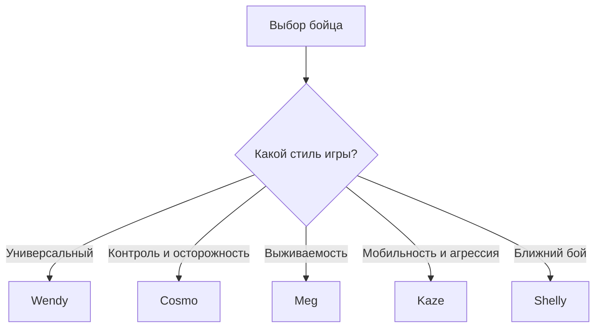

# ⭐ Лучшие бойцы в режиме «Одиночное столкновение» — Brawl Stars

> **Одиночное столкновение (Solo Showdown)** — режим Brawl Stars, в котором несколько бойцов сражаются друг с другом, а победителем становится последний выживший.

## 📚 Навигация

- [🏆 Топ-5 бойцов](#-топ-5-бойцов)
- [📊 Сравнение бойцов](#-сравнение-бойцов)
- [🔥 Что делает бойца сильным](#-что-делает-бойца-сильным)
- [🎯 Как выбрать бойца](#-как-выбрать-бойца)
- [💻 Пример кода](#-пример-кода)
- [📈 Схема выбора бойца](#-схема-выбора-бойца)
- [🌐 Полезные ссылки](#-полезные-ссылки)
- [📌 Итоговый рейтинг](#-итоговый-рейтинг)
- [✅ Список задач](#-список-задач)

---

## 🏆 Топ-5 бойцов

### 1. 👻 Wendy


**Wendy** — один из самых сильных вариантов для «Одиночного столкновения» по актуальной статистике сентября 2026 года. Она хорошо сочетает урон, выживаемость и возможность занимать выгодные позиции.

- **Сильные стороны:** высокий потенциал выживания, давление на соперников, хорошая эффективность после сбора кубиков силы.
- **Стиль игры:** контроль территории и постепенное усиление.
- **Сложность:** ⭐⭐⭐☆☆
- **Лучше всего подходит:** игрокам, которые любят играть от позиции и не рисковать без необходимости.

> **Совет:** не спешите вступать в бой с несколькими противниками одновременно — в «Одиночном столкновении» позиция часто важнее количества нанесённого урона.

---

### 2. 🌌 Cosmo


**Cosmo** показывает очень высокие показатели эффективности, хотя его доля выбора заметно ниже, чем у самых популярных бойцов. Это хороший пример того, почему нельзя оценивать героя только по популярности.

- **Сильные стороны:** высокий потенциал победы, контроль пространства, сильная игра в конце матча.
- **Стиль игры:** осторожное накопление преимущества.
- **Сложность:** ⭐⭐⭐⭐☆
- **Лучше всего подходит:** опытным игрокам, которые умеют выбирать момент для атаки.

---

### 3. 🦾 Meg


**Meg** — боец с высокой выживаемостью и хорошими возможностями для продолжения боя. Её преимущества особенно заметны, когда нужно пережить несколько столкновений подряд.

- **Сильные стороны:** выживаемость, стабильный урон, возможность продолжать сражение.
- **Стиль игры:** безопасный фарм и постепенное усиление.
- **Сложность:** ⭐⭐⭐☆☆
- **Лучше всего подходит:** игрокам, которые предпочитают надёжность агрессивным розыгрышам.

---

### 4. ⚔️ Kaze


**Kaze** — агрессивный боец, который хорошо использует мобильность и внезапные атаки.

- **Сильные стороны:** мобильность, высокий burst-урон, возможность быстро добивать ослабленных врагов.
- **Стиль игры:** поиск одиночных целей и быстрые атаки.
- **Сложность:** ⭐⭐⭐⭐☆
- **Лучше всего подходит:** игрокам с хорошей реакцией и пониманием дистанции.

---

### 5. 🧨 Shelly


**Shelly** особенно опасна на небольших дистанциях. Она хорошо чувствует себя на картах с кустами и узкими проходами, где противнику сложно держать дистанцию.

- **Сильные стороны:** огромный урон вблизи, контроль кустов, сильный Super.
- **Стиль игры:** засады и ближний бой.
- **Сложность:** ⭐⭐☆☆☆
- **Лучше всего подходит:** новичкам и игрокам, которым нравится агрессивный стиль.

**Главное преимущество Shelly — возможность быстро превратить одну удачную засаду в большое преимущество.**

---

## 📊 Сравнение бойцов

| Боец | Урон | Выживаемость | Мобильность | Концовка матча | Сложность |
|---|:---:|:---:|:---:|:---:|:---:|
| **Wendy** | ⭐⭐⭐⭐ | ⭐⭐⭐⭐ | ⭐⭐⭐⭐ | ⭐⭐⭐⭐⭐ | ⭐⭐⭐ |
| **Cosmo** | ⭐⭐⭐⭐ | ⭐⭐⭐⭐ | ⭐⭐⭐ | ⭐⭐⭐⭐⭐ | ⭐⭐⭐⭐ |
| **Meg** | ⭐⭐⭐⭐ | ⭐⭐⭐⭐⭐ | ⭐⭐⭐ | ⭐⭐⭐⭐ | ⭐⭐⭐ |
| **Kaze** | ⭐⭐⭐⭐⭐ | ⭐⭐⭐ | ⭐⭐⭐⭐⭐ | ⭐⭐⭐⭐ | ⭐⭐⭐⭐ |
| **Shelly** | ⭐⭐⭐⭐⭐ | ⭐⭐⭐⭐ | ⭐⭐⭐ | ⭐⭐⭐⭐ | ⭐⭐ |

### 📌 Критерии оценки

1. **Урон** — насколько быстро боец способен победить противника.
2. **Выживаемость** — способность переживать атаки и несколько столкновений подряд.
3. **Мобильность** — возможность быстро менять позицию и уходить от опасности.
4. **Концовка матча** — эффективность в ситуации, когда остаётся мало игроков и зона становится маленькой.
5. **Сложность** — насколько много навыков требуется для эффективной игры.

---

## 🔥 Что делает бойца сильным

В «Одиночном столкновении» недостаточно просто наносить большой урон. Хороший боец должен уметь **выживать, собирать кубики силы и выбирать выгодные сражения**.

### Основные преимущества сильного бойца

- 💥 высокий урон;
- ❤️ хорошая выживаемость;
- ⚡ мобильность или возможность быстро уйти из опасной ситуации;
- 📦 эффективный сбор кубиков силы;
- 🌿 способность контролировать кусты и ключевые участки карты;
- ☠️ возможность быстро добивать ослабленных противников;
- 🏆 хорошая эффективность в конце матча.

### Почему кубики силы важны?

Каждый собранный кубик увеличивает характеристики бойца. Поэтому ранний контроль ящиков может создать **снежный ком**: боец получает преимущество → легче побеждает врагов → получает ещё больше кубиков → становится ещё сильнее.

---

## 🎯 Как выбрать бойца

Выбор зависит от того, какой стиль игры вам нравится:

- Если нужен **сильный универсальный вариант** → **Wendy**.
- Если нравится **контроль и осторожная игра** → **Cosmo**.
- Если важна **выживаемость** → **Meg**.
- Если нравится **агрессивная мобильная игра** → **Kaze**.
- Если хочется **простого и мощного ближнего боя** → **Shelly**.

### 🧠 Полезные правила для Solo Showdown

**1. Не обязательно атаковать первым.**  
Иногда выгоднее дождаться, пока два противника ослабят друг друга.

**2. Следите за кубиками.**  
Собранное преимущество помогает выигрывать последующие сражения.

**3. Не забывайте о ядовитом облаке.**  
К концу матча безопасная зона уменьшается, поэтому заранее занимайте выгодную позицию.

**4. Не преследуйте противника слишком долго.**  
Погоня может привести прямо к другому врагу.

---

## 💻 Пример кода

Небольшая программа на **Java**, которая выбирает бойца с самым высоким условным рейтингом:

```java
public class BrawlerExample {

    static class Brawler {
        String name;
        int rating;

        Brawler(String name, int rating) {
            this.name = name;
            this.rating = rating;
        }
    }

    public static void main(String[] args) {
        Brawler[] brawlers = {
            new Brawler("Wendy", 10),
            new Brawler("Cosmo", 9),
            new Brawler("Meg", 9),
            new Brawler("Kaze", 9),
            new Brawler("Shelly", 8)
        };

        Brawler best = brawlers[0];

        for (Brawler brawler : brawlers) {
            if (brawler.rating > best.rating) {
                best = brawler;
            }
        }

        System.out.println("Лучший боец: " + best.name);
    }
}
```

---

## 📈 Схема выбора бойца



---

## 🌐 Полезные ссылки

- [Официальный сайт Brawl Stars](https://supercell.com/en/games/brawlstars/)
- [Brawl Stars — официальный сайт](https://brawlstars.com/)
- [Brawl Stars Wiki](https://brawlstars.fandom.com/wiki/Brawl_Stars_Wiki)
- [Статистика Solo Showdown — Brawl Time Ninja](https://brawltime.ninja/tier-list/mode/solo-showdown)
- [Рейтинг Solo Showdown — BrawlOne](https://www.brawl.one/best-by-mode/solo-showdown)
- [Статистика Showdown — Brawl Planet](https://www.brawlplanet.com/modes/showdown)

> 📊 **Примечание:** мета Brawl Stars постоянно меняется из-за балансных обновлений. Поэтому этот рейтинг ориентирован на статистику Solo Showdown сентября 2026 года и может измениться после следующего обновления.

---

## 📝 О проекте

Этот **README.md** посвящён лучшим бойцам режима **«Одиночное столкновение»** в Brawl Stars.

**Главная идея проекта:** сравнить бойцов по ключевым характеристикам и показать, какой персонаж лучше подходит под разные стили игры.

> **Важно:** высокий процент побед не всегда означает, что боец подходит каждому игроку. Личный навык, карта, сборка и стиль игры также сильно влияют на результат.

---

## 💬 Цитата

> «В Одиночном столкновении побеждает не всегда самый сильный боец — часто побеждает тот, кто лучше выбирает момент для сражения.»

---

## 📂 Структура проекта

```text
brawl-stars-solo-showdown/
├── README.md
├── src/
│   └── brawler_example.java
├── translations/
│   └── brawlers_en.md
└── resources/
    └── sources.md
```

### Документы проекта

1. [Пример Java-кода](src/brawler_example.java)
2. [Названия бойцов на английском](translations/brawlers_en.md)
3. [Источники и материалы](resources/sources.md)

---

## 📌 Итоговый рейтинг

| Место | Боец | Основная причина |
|:---:|---|---|
| 🥇 | **Wendy** | Сильная общая эффективность |
| 🥈 | **Cosmo** | Высокий потенциал при грамотной игре |
| 🥉 | **Meg** | Выживаемость и стабильность |
| 4 | **Kaze** | Мобильность и burst-урон |
| 5 | **Shelly** | Очень сильный ближний бой |

### 🏆 Кому какой боец подходит?

**Новичок:** Shelly  
**Любитель агрессии:** Kaze  
**Любитель безопасной игры:** Meg  
**Опытный игрок:** Cosmo  
**Универсальный выбор:** Wendy

---

## 🔗 Источники статистики

Актуальный рейтинг сверялся с данными трекеров Solo Showdown. В сентябре 2026 года разные сервисы используют разные показатели: например, BrawlOne ранжирует бойцов по недавней эффективности и надёжности выборки, а Brawl Time Ninja отдельно показывает скорректированный процент побед. Поэтому небольшие различия между рейтингами нормальны. 

---

## 📌 Список задач

- [x] Выбрать тему проекта
- [x] Добавить несколько заголовков
- [x] Добавить навигацию по документу
- [x] Добавить внутренние ссылки
- [x] Добавить внешние ссылки
- [x] Добавить изображения
- [x] Добавить описание проекта
- [x] Использовать разные способы выделения текста
- [x] Добавить цитаты
- [x] Добавить горизонтальные линии
- [x] Добавить маркированный список
- [x] Добавить нумерованный список
- [x] Добавить таблицу
- [x] Добавить пример Java-кода
- [x] Добавить Mermaid-диаграмму
- [x] Добавить ссылки на документы проекта

---

### ⭐ Спасибо за просмотр!

**Good luck & Have fun! 🎮🏆**
