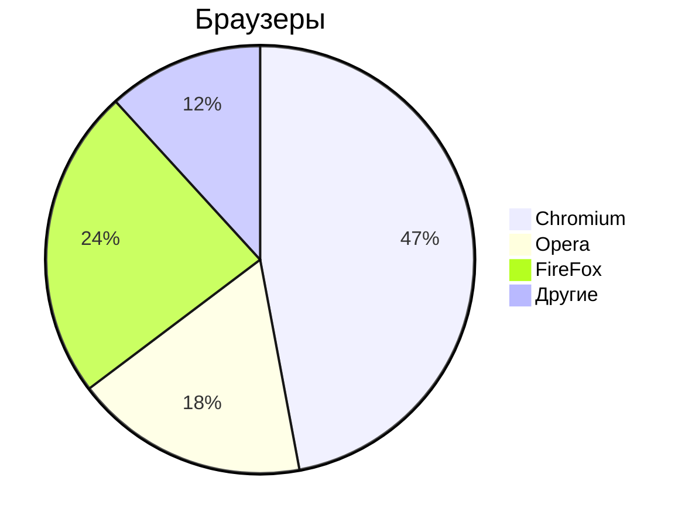

# Markdown

Markdown - простое фороматирование документа, пригодное для Git-репозиториев, документации и заметок.

# Основы редактирования текста 

### Курсор 

Клавиши 

- `Home` - курсор в начало строки
- `END` - курсор в конец строки 
- `pgUP` - курсор вверх видимой части документа 
- `PGdown` - курсор вниз видимой части документа

### Выделение текста 

- `Ctrl+A` - выделить весь текст 
- `Ctrl+S` - сохранить документ 
- `Ctrl+C` - копировать выделенное 
- `Ctrk+V` - вставить выделенное 

### Копирование/вставка
- `Ctrl+Shift+C` - копировать выделенное в терминале 
- `Ctrl+Shift+V` - вставить выделенное в терминаале 

### Редактирование текста
- `Del` - удалить символ справа от курсора 
- `Backspase` - удалить символ слева от курсора 
- `Ins/Insert` - замещение старого текста новым справа от курсора 
- `Ctrl+>` - перемещение по словам вправо
- `Ctrl+<` - перемещение по словам влево

--- 

## Markdown 

Заголовки

# - Заголовок 1-го уровня
## - Заголовок 2-го уровня
### - Заголовок 3-го уровня
#### - Заголовок 4-го уровня

Текст

- **Жирный текст**
- *Курсив*
- ~~Зачеркнутый текст~~
- <u>Подчеркнутый текст<u>

Горизонтальные линии

--- 

***

Списки


Ненумированный

- Пункт 1
- Пункт 2

* Пункт 1 
* Пункт 2
    - Пункт 1
    - Пункт 2

Нумерованный 
1. Пункт 1
1. Пункт 2
1. Пункт 3
    1. Пункт 3_1
    1. Пункт 3_2

Ссылки 

Внутренние ссылки

[текст ссылки](/content/Mermaid/README.md)
- Якоря по документа
[Редактирование] (#text-editor)

Внешние ссылки

- [ОЗОН](https://ozon.ru)

Изображения

![Текст, если картинка не отображается] ()

Код

`Ctrl+R` - обновить страницу браузера
`F5`     - обновить страницу браузера

```python
print("Hello") {}
```
```cpp
int main() {}
    pust("Hello")
{}
```


Цитаты

> Тут важный текст! 

Таблицы

| Заголовок 1 | Заголовок 2 | Заголовок 3 |
| ----------- | ----------- | ----------- |
| Ячейка 1    | Ячейка 2    | Ячейка 3    |
| Ячейка 4    | Ячейка 5    | Ячейка 6    |


